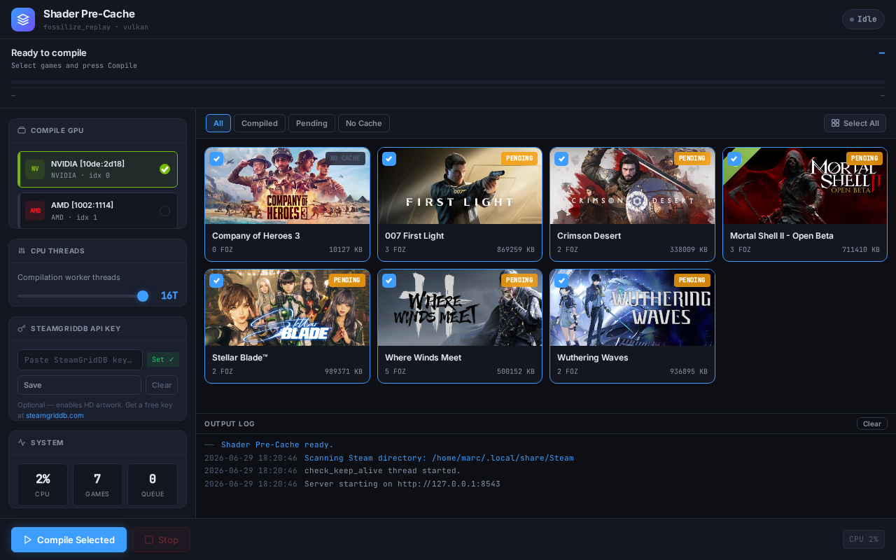
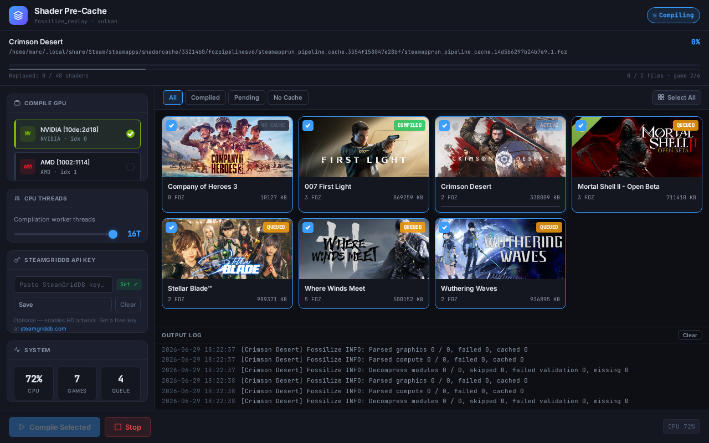
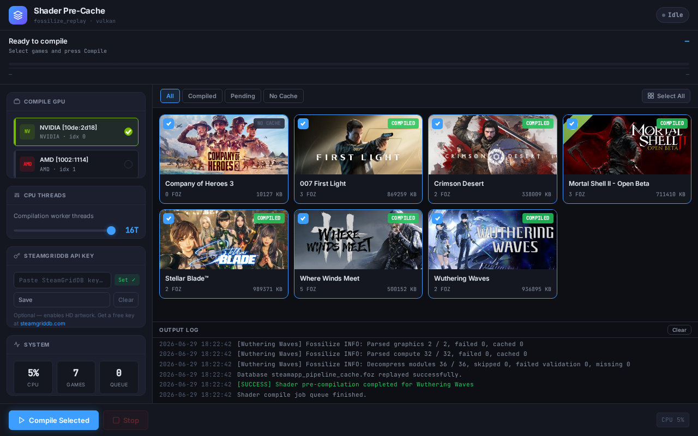

# Shader Pre-Cache

**Pre-compile Vulkan pipeline shaders for your Steam games — eliminate stutter before you ever launch a game.**


---

## Screenshots

| Idle — game library | Compiling — live progress | Done — compiled badges |
|:---:|:---:|:---:|
|  |  |  |

---

## The problem: what causes shader stutter on Linux


When you play a Windows game through Proton, DirectX calls are translated to Vulkan by DXVK or VKD3D-Proton. Vulkan can't execute shaders as-is — each pipeline state object (the combination of a shader program, blend state, vertex layout, render pass, and more) must be compiled by your GPU driver into hardware machine code before it can run. That compilation happens on-demand: the first time the game triggers a new pipeline, the driver stalls to compile it. You feel that as a hitch or dropped frame.

Steam addresses this through two mechanisms working together:

1. **Recording** — A Fossilize layer captures every unique Vulkan pipeline state your game encounters during play, writing them into `.foz` files on disk.
2. **Replay** — `fossilize_replay` reads those `.foz` files and drives your local GPU driver to compile each pipeline ahead of time, populating the driver's on-disk shader cache. The next time the game hits that pipeline, the driver loads it from cache instantly.

Steam also distributes community-sourced `.foz` packs so players can benefit from pipelines others have already recorded, even before their first session. These packs are downloaded and replayed locally on your own hardware — Steam does not ship pre-built GPU machine code, because compiled binaries are GPU and driver-version specific.

---

## What this tool adds

Steam's built-in replay runs automatically on game download or update, and optionally in the background while Steam is open. That covers the common case well. This tool is useful in situations the built-in system doesn't handle:

- **After a GPU driver update.** Driver updates invalidate previously compiled pipelines, and Steam may not automatically re-replay your full recorded set. Running this tool immediately after an update recompiles everything from your `.foz` files against the new driver.
- **Per-game, on demand.** Steam processes all games; this tool lets you target specific titles and re-run the replay whenever you want — without waiting for a game launch to trigger it.
- **Full control over resources.** Choose exactly how many CPU threads `fossilize_replay` uses and which GPU to compile against — useful on hybrid GPU laptops where you want to target your discrete card.
- **Visibility.** Live output from `fossilize_replay`, per-file progress, and per-game completion badges so you know exactly what has been compiled and what hasn't.

---

## Features

- **Scans all Steam libraries** automatically and finds every game with a `.foz` pipeline cache
- **Compiles on your GPU** using the `fossilize_replay` binary already bundled inside your Steam installation — no extra tools needed
- **Multi-GPU aware** — select which GPU to target; useful for hybrid laptop setups (e.g. NVIDIA dGPU + AMD iGPU)
- **Thread count slider** — control how many CPU threads `fossilize_replay` uses
- **Per-game selection** — compile one game or all of them at once
- **Live progress log** — real-time `fossilize_replay` output, per-file and per-game progress bars
- **Game artwork** — header images loaded automatically from Steam's CDN; optionally use a [SteamGridDB](https://www.steamgriddb.com) API key for higher-quality community artwork
- **Compiled / Pending badges** — at-a-glance status for each game in your library
- **Cache clear** — wipe a game's compiled cache with one click to force a full recompile from scratch
- **Self-contained binary** — one file, no Python runtime required after build

---

## Installation

```bash
git clone https://github.com/yourusername/steam-shader-compiler
cd steam-shader-compiler
chmod +x install.sh
./install.sh
```

The installer will:

1. Build a self-contained binary with PyInstaller
2. Install it to `~/.local/share/steam-shader-compiler/`
3. Create a desktop entry so it appears in your application launcher
4. Optionally set up a systemd timer to run automatically every 6 hours

**Requirements:**

- Linux — Arch, CachyOS, SteamOS, Ubuntu, Fedora, or any distro with Steam installed
- Steam at `~/.local/share/Steam` or `~/.steam/steam`
- Python 3.8+ (build only; the installed binary is self-contained)
- A Vulkan-capable GPU

---

## Usage

Launch **Shader Pre-Cache** from your application menu, or run:

```bash
steam-shader-compiler
```

The app opens in your browser at `http://127.0.0.1:8543`.

1. Your games appear automatically — any game with `.foz` pipeline cache files shows a **Pending** badge
2. Select the games you want to compile (all are selected by default)
3. Choose your GPU and thread count in the sidebar
4. Click **Compile Selected**
5. Watch the live log as each game's pipelines are replayed through `fossilize_replay`
6. Games show a **Compiled** badge when done

---

## How it works under the hood

While you play, Steam's Fossilize layer records every Vulkan pipeline state the game encounters into `.foz` files:

```
~/.local/share/Steam/steamapps/shadercache/<appid>/fozpipelinesv6/
```

This tool finds all those files, then calls Steam's own `fossilize_replay` binary:

```bash
fossilize_replay --num-threads <N> --device-index <GPU> --progress <file.foz>
```

`fossilize_replay` feeds each recorded pipeline state through your local Vulkan driver, which compiles it to GPU machine code and writes it into the driver's on-disk cache. When the game runs next, the driver finds those compiled pipelines in cache and skips the on-demand compilation entirely.

This is the same mechanism Steam uses internally for its own background pre-caching — this tool just gives you direct, manual control over when it runs, for which games, and with which resources.

---

## When to re-run

| Situation | Action |
|---|---|
| GPU driver updated | Re-run for affected games |
| New game installed | Run for that game before first session |
| Shader stutter returned unexpectedly | Clear cache for that game, then re-run |
| You've played significantly more of a game | Re-run to compile newly recorded pipelines |

---

## Project files

| File | Purpose |
|------|---------|
| `steam_shader_compiler.py` | Backend HTTP server and fossilize runner |
| `index.html` | Web UI served by the backend |
| `steam-shader-compiler.spec` | PyInstaller build spec |
| `install.sh` | Build and install script |
| `uninstall.sh` | Uninstall script |

---

## FAQ

**Does this replace Steam's built-in shader pre-caching?**
No — they complement each other. Steam's system downloads community-recorded `.foz` packs and replays them automatically. This tool replays the `.foz` files recorded from *your own sessions*, on demand, and gives you manual control over when and how the replay runs. Both are worth having.

**Will running this twice cause any harm?**
No. `fossilize_replay` skips pipelines that are already compiled in the driver cache. Re-running after games are already compiled is fast and safe.

**Is it safe to run while Steam is open?**
Yes. The `.foz` source files are only read, never modified. The compiled pipeline cache is written by the Vulkan driver.

**Why do I need to re-run after a driver update?**
Compiled pipeline binaries are specific to your GPU driver version. A driver update invalidates the previously compiled cache, and the pipelines need to be replayed again against the new driver.

**My game still stutters after compiling. Why?**
`fossilize_replay` can only compile pipelines that have been recorded in your `.foz` files. Areas of a game you haven't played yet won't have their pipelines recorded, so stutter can still occur when you first enter new content. Playing further and re-running the tool will cover more of the game over time.

---

## Uninstall

```bash
./uninstall.sh
```

---

## Credits

Built on top of [Fossilize](https://github.com/ValveSoftware/Fossilize) by Valve Software, which is bundled inside every Steam installation at:

```
~/.local/share/Steam/ubuntu12_64/fossilize_replay
```

