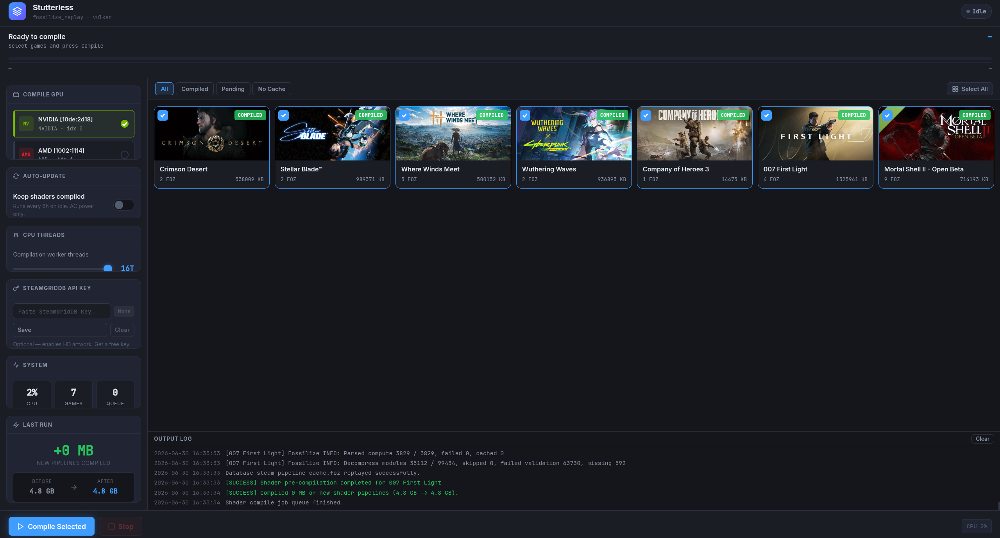
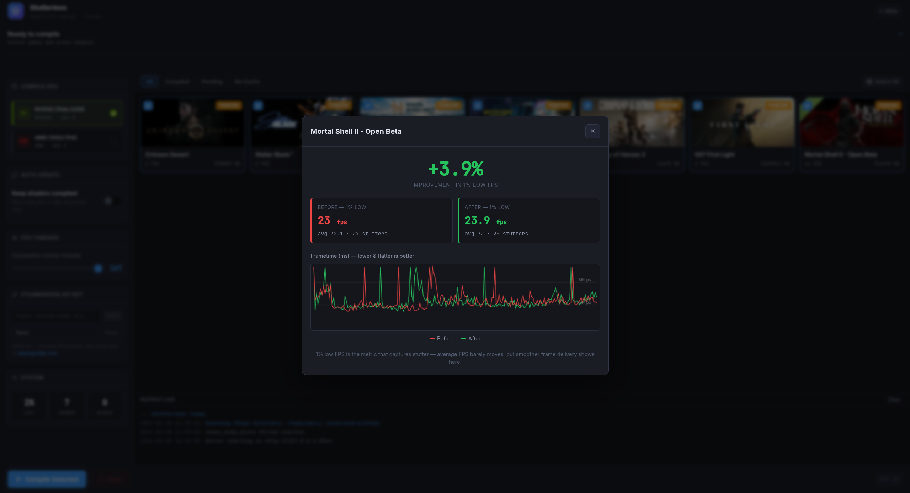

# Stutterless

**Pre-compile Vulkan pipeline shaders for your Steam games on your own GPU — and measure the difference.**


---

## Screenshots

**Game library** — every Steam game with a recorded shader cache, with per-game FOZ count and cache size.



**Compiling** — live `fossilize_replay` output, per-file and cross-game progress, GPU and thread controls.


**Benchmark** — optional before/after frametime comparison for a game, headlined by the 1% low FPS.



---

## What causes shader stutter on Linux

When a Windows game runs through Proton, DirectX is translated to Vulkan by DXVK or VKD3D-Proton. Vulkan can't run a shader directly — each *pipeline state object* must first be compiled by your GPU driver into hardware machine code. By default this happens on-demand: the first time the game uses a new pipeline, the driver pauses to compile it, and you feel that pause as a hitch or dropped frame.

## What Steam already does

Steam records every unique pipeline your game encounters into Fossilize `.foz` files, and runs Valve's `fossilize_replay` tool to compile them ahead of time. Steam does this automatically on game download/update and, optionally, in the background while Steam is open. It also downloads community-recorded `.foz` packs so you benefit from pipelines other players have already seen. These packs are compiled locally on your hardware — Steam doesn't ship pre-built GPU binaries, because compiled pipelines are specific to your exact GPU and driver version.

## What Stutterless adds

Stutterless uses the same `fossilize_replay` tool Steam ships, but gives you manual control Steam doesn't:

- **Run it on demand** — after a driver update (which invalidates the compiled cache), after installing a game, or any time stutter returns.
- **Per-game** — compile one title or all of them, rather than all-or-nothing.
- **Pick your GPU and thread count** — useful on hybrid laptops where you want to target the discrete GPU.
- **See the result** — before/after cache size, and an optional MangoHud benchmark showing your 1% low FPS and frametime graph before vs after compiling.
- **Auto-update (optional)** — a background timer keeps shaders compiled, and only runs while on AC power.

Stutterless complements Steam's system; it doesn't replace it.

---

## Install

```bash
git clone https://github.com/mrcgibb9876-hash/stutterless
cd stutterless
chmod +x install.sh
./install.sh
```

The installer detects your package manager (pacman / apt / dnf), checks and installs dependencies, builds a self-contained binary, and adds a desktop entry.

**Dependencies**

| | Package | Purpose |
|---|---|---|
| Required | Python 3, Vulkan loader | Core |
| Required (build) | PyInstaller | Builds the binary |
| Optional | MangoHud | Frametime benchmarking |
| Optional | libnotify | Driver-update notifications |

Steam must be installed and run at least once (Stutterless uses the `fossilize_replay` binary bundled inside it).

---

## How to use it

1. Launch **Stutterless** from your app menu, or run `stutterless`. It opens in your browser at `http://127.0.0.1:8543`.
2. Games with recorded shaders appear with a **Pending** badge.
3. Pick a GPU and thread count in the sidebar, select games, and click **Compile Selected**.
4. Watch the live log. Games show a **Compiled** badge and the before/after cache size when done.

### Optional: benchmark a game

Click the chart icon on any game card to open its benchmark panel. It gives you a one-line Steam launch option to paste in; play through a stutter-prone area before compiling, compile, then play the same area again. Stutterless parses the two MangoHud logs and shows your **1% low FPS** before vs after with a frametime graph.

The size of the gain depends on how much was left to compile. If a game's cache is already fully built (Steam may have done it in the background, or you compiled earlier), there's little or nothing new to gain and the difference will be small — that's expected. The biggest improvements show on a fresh cache or right after a driver update, when the most pipelines are compiled on-demand. For a fair comparison, play the same area for a similar length of time in both runs.

---

## When to re-run

| Situation | Why |
|---|---|
| GPU driver updated | The compiled cache is invalidated and must be rebuilt |
| New game installed | No pipelines compiled for it yet |
| Stutter returned | Clear that game's cache, then recompile |
| Played much more of a game | New areas record new pipelines to compile |

---

## How it works under the hood

While you play, Steam's Fossilize layer records pipeline states into:

```
~/.local/share/Steam/steamapps/shadercache/<appid>/fozpipelinesv6/
```

Stutterless finds those `.foz` files and runs Steam's own binary against them:

```bash
fossilize_replay --num-threads <N> --device-index <GPU> --progress <file.foz>
```

`fossilize_replay` feeds each recorded pipeline through your Vulkan driver, which compiles it to machine code and writes it into the driver's on-disk cache. When the game launches next, those pipelines load from cache instead of compiling mid-frame.

---

## FAQ

**Does this replace Steam's shader pre-caching?**
No. They work together. Steam handles community packs and automatic runs; Stutterless replays *your own* recorded sessions on demand with full control.

**Is it safe to run while Steam is open?**
Yes. The `.foz` files are only read. The compiled cache is written by the Vulkan driver.

**My game still stutters after compiling — why?**
`fossilize_replay` can only compile pipelines that were recorded. Areas you haven't played yet aren't in the `.foz` files. Play further and re-run.

**Why only run auto-update on AC power?**
A full compile is CPU-intensive; gating on AC power avoids draining a laptop or handheld battery.

---

## Uninstall

```bash
./uninstall.sh
```

---

## Credits

Built on [Fossilize](https://github.com/ValveSoftware/Fossilize) by Valve Software, bundled inside every Steam install at `~/.local/share/Steam/ubuntu12_64/fossilize_replay`.
